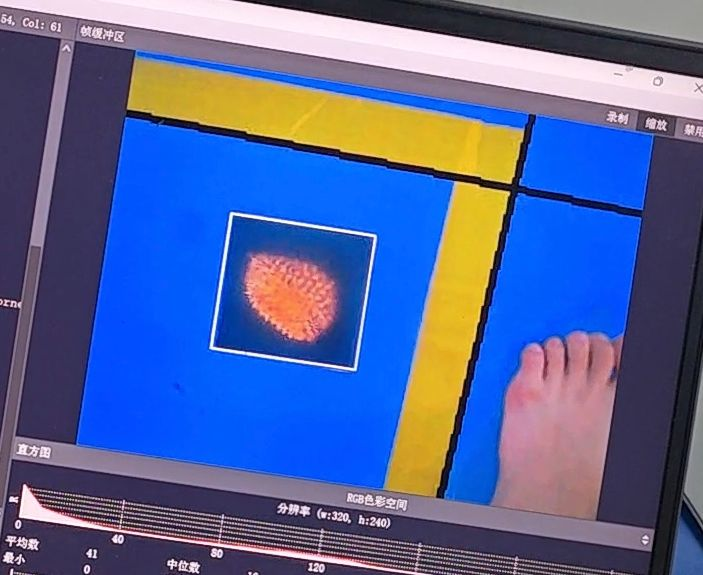

感谢 **中国矿业大学（北京）的FredBill佬** 开源的固件开发办法！

感谢 **中国矿业大学（北京）的FredBill佬** 开源的固件开发办法！！

感谢 **中国矿业大学（北京）的FredBill佬** 开源的固件开发办法！！！

目前测试该固件只能够给openart  **v1.3** 和 **v2.0** 的硬件版本烧录固件

部分固件魔改函数效果：[这里](https://www.bilibili.com/video/BV1Gu411N72L)观看。（视频第17秒有效果演示）

### ** _固件使用注意事项：_ ** 

1. 固件的.axf文件在逐飞群文件中已经上传，烧录即可直接使用（需在蓝色背景下使用）[烧录工具](https://github.com/JayHeng/NXP-MCUBootUtility)

2. 同时openart国赛使用代码也已经上传在逐飞智能视觉群中，可以直接下载，该开源链接主要为二次开发参考使用

3. 该固件函数只适配了qvga图像，其他画布大小可能会报错，部分函数的roi参数不可使用

4. find_rect函数已经魔改为只对蓝色背景有效，使用hsv分割图像，生长算法，凸包算法，道格拉斯抽稀曲线算法，解算轮廓，实测单独运行帧率高达25帧

5. find_rect函数已经魔改为只对蓝色背景有效，使用hsv分割图像，仅分割边界线，阉割合并线段功能,实测单独运行帧率接近30帧

 **参数说明** ：

- 例如find_rects(threshold = 5,quality = 80100)

    其中quality 参数位hsv中的sv参数，smin = quality/1000,vmin = quality%1000

    threshold参数建议值为5，该参数好像自从切换为hsv色域后不需要调整了（是我最早开发rgb模式用的参数）

- 例如find_lines(x_stride = 60, y_stride = 60,threshold = 240,theta_margin =11 ,rho_margin = 45)

    其中x_stride为s参数，y_stride为v参数，threshold为线段长度，theta_margin为线段颜色的hmin,rho_margin为线段颜色的hmax

###  _**二次开发提醒：**_ 

可以使用mp_printf函数打印调试信息

fb_alloc 和 fb_free 函数可以操作内存池

此开源链接已经对apriltag.c等文件二次开发

**如需重新二次开发请移步参考链接** 
[NXPmicro/OpenART](https://github.com/NXPmicro/OpenART.git) 
