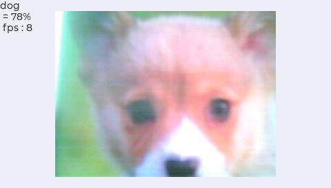
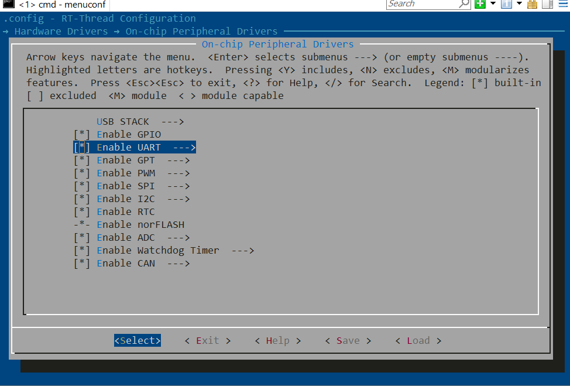

# Example : Cifar10 with LVGL  #

## Overview ##

This example is showing the ciar10 TF-lite Micro model running on OpenART.

The model classify a picture which is captured from the camera.

With a simple UI showing the result.

## Requirements ##

### Hardware ###

#### MIMXRT1060EVK ####

SD Card

LCD: RK043FN02H-CT

Camera: OV7725 

#### MIMXRT1170EVK ####

SD Card

LCD: RK055HDMIPI4M

Camera: MT9M114 

### Software ###

Model Files: "cifar10_quant.tflite", "labels.txt". These two files need store in SD Card

IDE: MDK V5.33

#### Project Config ####

Open env tools in 'bsp\imxrt\imxrt1062-nxp-evk' or 'bsp\imxrt\imxrt1176-nxp-evk'

Use command 'menuconfig' to configurate the project

Make sure "MicroPython, OpenMV" in 'NXP Software Components' is enabled shown as :

 
 

And the in 'Hardware Drivers' the configuration is shown as :

**Please notice that 'GPT1' must be selected, LGVL is depending on it.**

After save the configuration, use command 'scons --target=mdk5 -s' to generate the project.

Open the project in MDK and compile it.

## Run the example ##

- 1 Download the program to the evk board

  2 Connect the debug COM with PC
  
  3 Plugin the SD Card after copy the model file , lables.txt and cifar10_lvgl.py
  
  4 Reset the borad, board enter msh mode
  
  5 Excute the scripyt by command: 'python cifar10_lvgl.py'
  
  6 Show a picture to the camera to test the model, result is shown in the left top label
  

