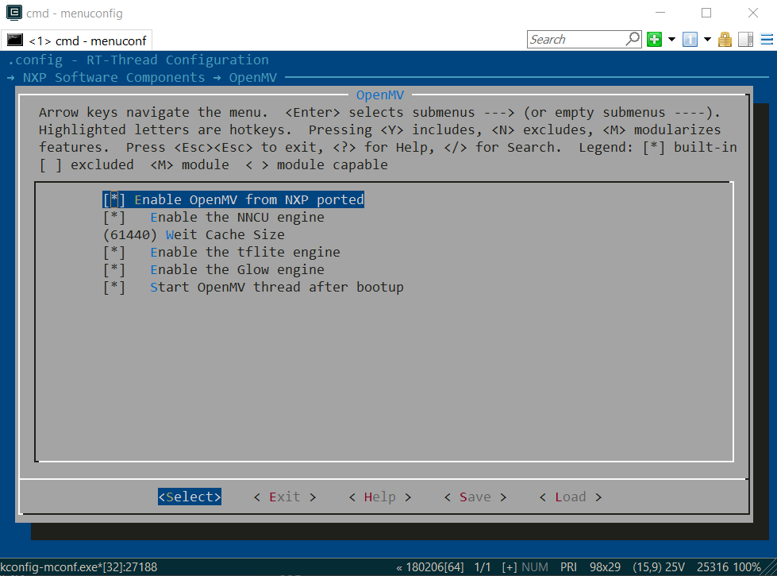
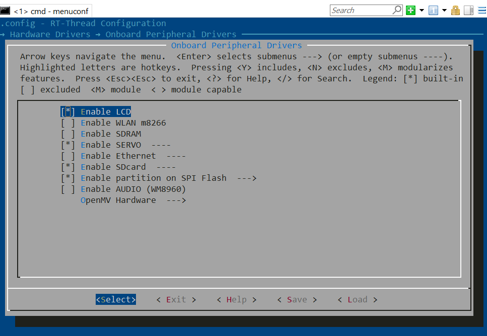

# SSD:Person Detection with LVGL

## Overview

An simple SSD example: find person in a picutre and show the locations

With a simple UI implemented by lvgl showing as:

## Requirements

### Hardware

#### MIMXRT1060EVK

SD Card

LCD: RK043FN02H-CT

Camera: OV7725 

#### MIMXRT1170EVK

SD Card

LCD: RK055HDMIPI4M

Camera: MT9M114 

### Software

Model Files: "person_detect_.tflite", "person_detect.py",These files need store in SD Card

IDE: MDK V5.33

OpenMV IDE: 2.6.7 or later

#### Project Config

Open env tools in 'bsp\imxrt\imxrt1062-nxp-evk' or 'bsp\imxrt\imxrt1176-nxp-evk'

Use command 'menuconfig' to configurate the project

Make sure "MicroPython, OpenMV" in 'NXP Software Components' is enabled shown as :

 
 

And the in 'Hardware Drivers' the configuration is shown as :

**Please notice that 'GPT1' must be selected, LGVL is depending on it.**

After save the configuration, use command 'scons --target=mdk5 -s' to generate the project.

Open the project in MDK and compile it.

## Run the example

- 1 Download the program to the evk board
  
  2 Connect the debug COM with PC
  
  3 Plugin the SD Card after copy the model file.
  
  ​    4 Rename  person_detect.py to main.py, copy to SD Card.
  
  ​    5 Reset the board, omv thread will run into main.py
  
  ​    OR
  
  ​    4 Reset the borad, board run into omv thread and connect with OpenMV IDE through usb cable.
  
  ​    5 Execute the person_detect.py in openMV IDE
  
  6 Show a picture or one person to the camera to test the model, result is shown in the left top label
